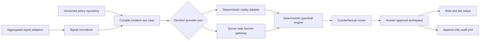
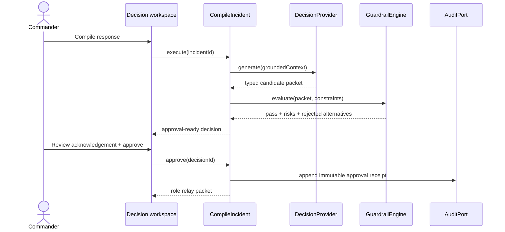

# Architecture

## Decision

Resolve 90 uses a small clean architecture with a functional domain core and explicit ports. The architecture is intentionally lighter than microservices for the current load and team size, but every external boundary is replaceable.

## Dependency rule

Dependencies point inward:

1. **Domain** imports nothing from React, HTTP, storage, or AI providers.
2. **Application** imports domain types and declares ports; it does not know adapter details.
3. **Infrastructure** implements application ports and validates external data.
4. **Presentation** invokes use cases and renders application view models. It contains no risk math, plan validation, or network calls.

ESLint import-boundary rules, TypeScript project references, review guidance, and tests enforce the dependency rule. A dedicated bootstrap composition root is the only UI-facing module allowed to assemble infrastructure adapters. The home decision path is eager to prevent layout shift; evidence routes and the live Gemini adapter are dynamically imported. Replay mode therefore does not execute the live provider boundary.

## Visible evaluation architecture

The product exposes architecture and operational evidence through `/architecture`, `/quality`, `/security`, `/testing`, `/accessibility`, and `/challenge-alignment`. Quality statistics are generated from machine-readable reports by `scripts/generate-quality-report.mjs`; React does not contain manually entered test, coverage, bundle, audit, or Lighthouse values. The same six evidence routes are generated as static HTML during every build, so raw-HTML evaluators and direct refreshes receive complete evidence without executing JavaScript.

Presentation styles are split into focused global, home, and evidence modules. Shared Button, Card, Badge, Metric, and SectionHeader primitives keep interaction and evidence patterns consistent. The server compile boundary is divided into handler, validation, limiter, provider, and structured-output schema modules.

## Runtime sequence

## GenAI boundary

The AI is used for high-entropy synthesis: cross-role sequencing, controlled-language messages, rationale, and fallback wording. It does not calculate capacity or decide whether a constraint passes.

The production adapter requests JSON-only output from Gemini. The gateway then:

1. limits request size and rate;
2. parses and validates the input schema;
3. supplies a bounded prompt and versioned policy excerpts;
4. requests structured output;
5. parses and validates the output schema;
6. returns no secret or raw provider metadata;
7. passes output to deterministic application guardrails.

Replay mode returns a pinned, pre-reviewed provider response through the same port, making the demo deterministic without misrepresenting it as live generation.

## Domain invariants

- A recommended plan must have exactly one owner, location, due time, fallback, and evidence set for every action.
- Crowd pressure must not exceed the safe threshold in either the target or spillover zone.
- Step-free capacity cannot fall below 90%; 95% is the recommendation target.
- Stale transport data produces a warning and blocks “high confidence.”
- Sustainability may break ties only after safety and accessibility constraints pass.
- No relay can be marked approved without a human acknowledgement event.
- Modeled metrics are never typed as measured metrics.

## Scaling path

| Current                     | Scale trigger                    | Evolution                                                       |
| --------------------------- | -------------------------------- | --------------------------------------------------------------- |
| In-memory replay repository | Real venue feeds                 | Event-normalization service with idempotency keys               |
| One serverless AI gateway   | Multi-venue sustained generation | Regional gateway, queue, distributed limiter, provider failover |
| Browser-local audit demo    | Regulated operational use        | Append-only event store, retention policy, signed receipts      |
| Static policy fixture       | Many venue policy versions       | Versioned retrieval service with approval workflow              |
| Single app deployment       | Multi-tenant tournament          | Tenant-isolated configuration and venue-scoped authorization    |

## Failure design

| Failure                | Behavior                                                             |
| ---------------------- | -------------------------------------------------------------------- |
| AI unavailable         | Offer pinned playbook/replay; never fabricate a live result          |
| Output schema invalid  | Reject candidate; show recoverable error; preserve incident context  |
| Stale signal           | Mark source stale, reduce confidence, and block relevant actions     |
| Accessibility conflict | Reject plan regardless of aggregate crowd benefit                    |
| Partial relay failure  | Keep approval receipt, show affected channel, allow idempotent retry |
| Client render failure  | Error boundary provides reload/recovery path                         |

## Architecture decisions

- [ADR-001: Clean modular monolith](docs/adr/001-clean-modular-monolith.md)
- [ADR-002: Deterministic guardrails around generation](docs/adr/002-deterministic-ai-guardrails.md)
